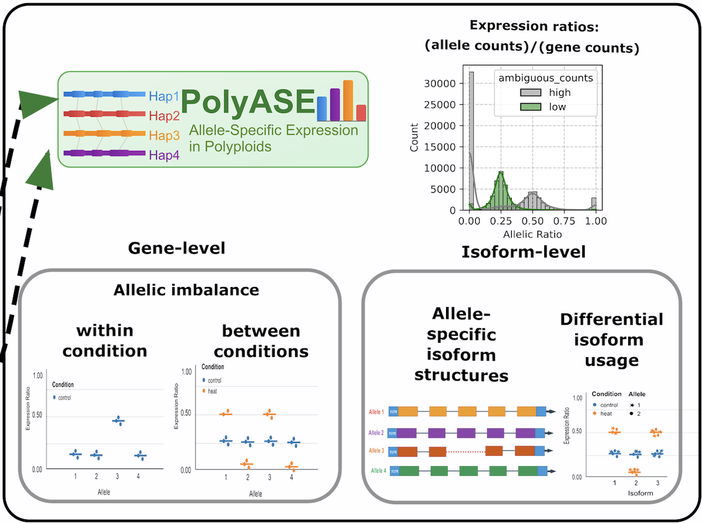

# Polyase

A Python package for analyzing allele-specific expression in polyploid plants.

## Installation

You can install polyase using pip:
pip install -i https://test.pypi.org/simple/ polyase==0.1.2

